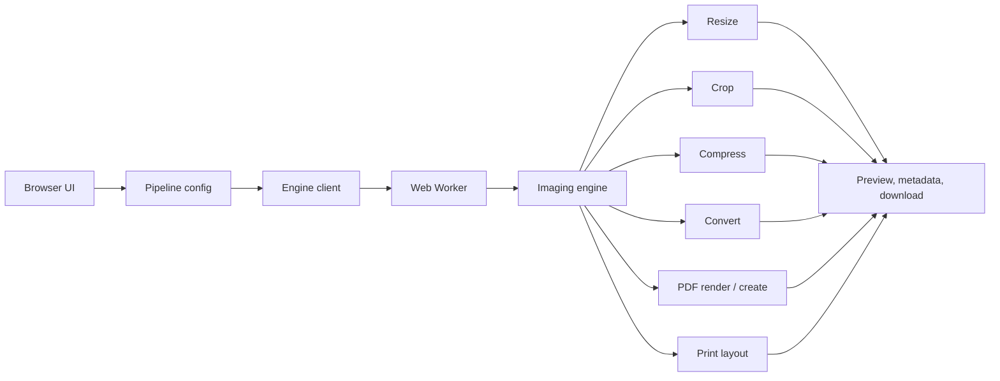

<p align="center">
  
</p>

<h1 align="center">FitForm</h1>

<p align="center">
  A client-side image and PDF workspace for resizing, cropping, compression,
  format conversion, printing, and document storage — all in the browser.
</p>

<p align="center">
  
  
  
  
  
</p>

<p align="center">
  <a href="https://fitform.slek.dev/"><strong>Open FitForm</strong></a>
  &nbsp;·&nbsp;
  <a href="https://fitform.slek.dev/privacy.html">Privacy</a>
  &nbsp;·&nbsp;
  <a href="https://fitform.slek.dev/terms.html">Terms</a>
</p>

---

## Overview

FitForm is a browser-based image and PDF toolkit built around one idea: give
people precise control over their files without making them upload those
files to a processing server.

It pairs a clean visual workflow with a processing engine that handles image
resizing, cover cropping, target-size compression, format conversion, PDF
page extraction, A4 print preparation, and JPEG-to-PDF creation — entirely
client-side. Expensive work runs in a Web Worker, so the interface stays
responsive even on large files.

An optional **Vault** lets you save documents to your own Google Drive,
so FitForm never needs a hosted database or file storage of its own.

## How it works

A file enters the pipeline, its metadata gets inspected, the selected
operations are assembled in order, and the engine runs them one after
another. The result comes back to the interface with its final dimensions,
format, and file size.



The interface and the processing engine are kept deliberately separate: the
React app owns pipeline controls, file selection, and result presentation,
while the [`imaging`](./imaging) package owns the actual image and PDF
operations. They only communicate through a single Web Worker — which
matters because a target-size JPEG search can take several encoding passes,
and PDF rendering can be memory-hungry, so neither should ever block the
main thread.

## Features

| Feature | What it does |
|---|---|
| **Resize** | Scales to an exact width/height using Triangle, Catmull-Rom, Mitchell, Lanczos3, HQX, or Magic Kernel resampling. |
| **Crop** | Cover-style crop against the decoded pixels, anchored to center, top, bottom, left, or right. |
| **Compress to a target size** | Works backwards from a file size (e.g. "under 200 KB") instead of a quality slider — narrowing quality, scale, chroma subsampling, and progressive encoding until it fits. |
| **Format conversion** | Decode/re-encode across JPG, PNG, WebP, BMP, and TGA. |
| **PDF → image** | Extract any page of a PDF as an image, then run it through the rest of the pipeline. |
| **Images → PDF** | Assemble processed JPEGs into a single PDF, no server required. |
| **A4 print prep** | Lays an image out for A4 printing at 300 DPI, with margins, alignment, and sizing handled for you. |

Because every operation lives in the same pipeline, they compose freely —
resize into a crop, compress the result, convert the format, and hand it
straight to print or PDF export, without exporting and re-importing between
steps.

## WebAssembly and codecs

Several operations are powered by WebAssembly: browser-compatible codecs for
JPEG, PNG, and WebP, PDFium for PDF rendering, and a native JPEG
optimization core (see [`imaging/native`](./imaging/native)) compiled to
WASM for the target-size compression path. The binaries ship as static
assets and load on demand — no native executable or backend required.

## The `imaging` package

[`imaging/`](./imaging) is a standalone TypeScript package with its own
browser and Node entry points, so the same processing code that runs in the
app is also exercised directly in tests:

```text
imaging/
├── src/
│   ├── compress.ts, convert/, pdfToImages.ts, jpegsToPdf.ts, printLayout.ts
│   ├── jpegopt-engine.ts
│   └── browser + node codec implementations
├── wasm/      compiled jpegopt WebAssembly engine
├── native/    C source for rebuilding the JPEG optimization core
└── test/      imaging engine tests
```

It's consumed as a local dependency (`"imaging": "file:./imaging"`), and the
app only ever imports its public interface — never its internals.

## Privacy model

Privacy is architectural here, not a checkbox in settings.

**Main pipeline:** your file never leaves the browser. There's no FitForm
upload endpoint in the image/PDF path — processing happens locally, which
matters for photos, scanned documents, and other files you'd rather not send
to a third-party server.

**Vault:** storage is your own Google Drive, not FitForm infrastructure.
Access is scoped to `drive.file`, which limits FitForm to files it created
and files you explicitly opened via Google's picker. The access token lives
in memory for the page session only — never in `localStorage` or
`sessionStorage`.

## Project structure

```text
.
├── src/
│   ├── components/    UI and pipeline controls
│   ├── engine/        Worker-based processing bridge
│   ├── drive/         Google Drive auth and API access
│   ├── state/         Pipeline state and configuration
│   └── App.tsx
├── imaging/           Reusable image/PDF processing package
├── public/
│   ├── wasm/          Static WebAssembly assets
│   ├── fonts/         Self-hosted fonts
│   ├── privacy.html
│   └── terms.html
├── scripts/           Build and test utilities
└── .github/workflows/ Deployment automation
```

## Getting started

Requires Node.js 18.17+ and npm.

```bash
npm install        # installs deps, builds the imaging package
npm run dev         # start the dev server
npm run build        # production build
npm run preview       # preview the production build locally
```

## Testing

```bash
npm test
```

This runs three suites:

- **Pipeline** — verifies UI choices translate into the correct processing
  configuration (resize, crop, compression, conversion, output handling).
- **Worker lifecycle** — covers startup, messaging, errors, cancellation,
  and restart behavior for the engine client.
- **Imaging smoke tests** — exercises the real imaging operations end to
  end: resize, compress, convert, print layout, JPEG→PDF, PDF page
  extraction.

## Deployment

FitForm builds to a static `dist/` directory that any static host can serve:

```bash
npm run build
```

For a GitHub Pages project site, set the base path first:

```bash
VITE_BASE_PATH=/repository-name/ npm run build
```

A GitHub Actions workflow for automated deployment is included under
[`.github/workflows`](./.github/workflows).

## Design principles

- **Local first** — process on-device whenever the browser can do the work.
- **Pipeline based** — operations compose instead of living as separate tools.
- **Explicit results** — always show the resulting dimensions and file size.
- **Responsive processing** — expensive work belongs in a worker, not the UI thread.
- **Static by default** — deployable without an application backend.
- **Reusable processing layer** — `imaging` stays independent of the React UI.

## Known limitations

- TGA output isn't natively previewable in most browsers or OSes.
- Lossy re-encodes (JPEG, WebP) lose information, as always.
- Large images and high-resolution PDF pages need meaningful memory.
- PDF rendering speed varies by device and browser.
- Vault needs an OAuth client configured for your deployment origin if
  you're self-hosting.
- WASM codecs add to the static bundle size, since the processing engines
  ship to the browser.

## License

FitForm and the bundled `imaging` package are both released under the MIT
License — see [`LICENSE`](LICENSE). Third-party packages, fonts, and
WebAssembly modules remain subject to their own licenses.

## Acknowledgements

Built on [React](https://react.dev), [Vite](https://vitejs.dev),
[Tailwind CSS](https://tailwindcss.com), [Radix UI](https://www.radix-ui.com),
[jSquash](https://github.com/jamsinclair/jSquash) codecs, and
[PDFium](https://pdfium.googlesource.com/pdfium/).

---

<p align="center">
  <strong>FitForm</strong> — process your files locally, keep control of your documents.
</p>
